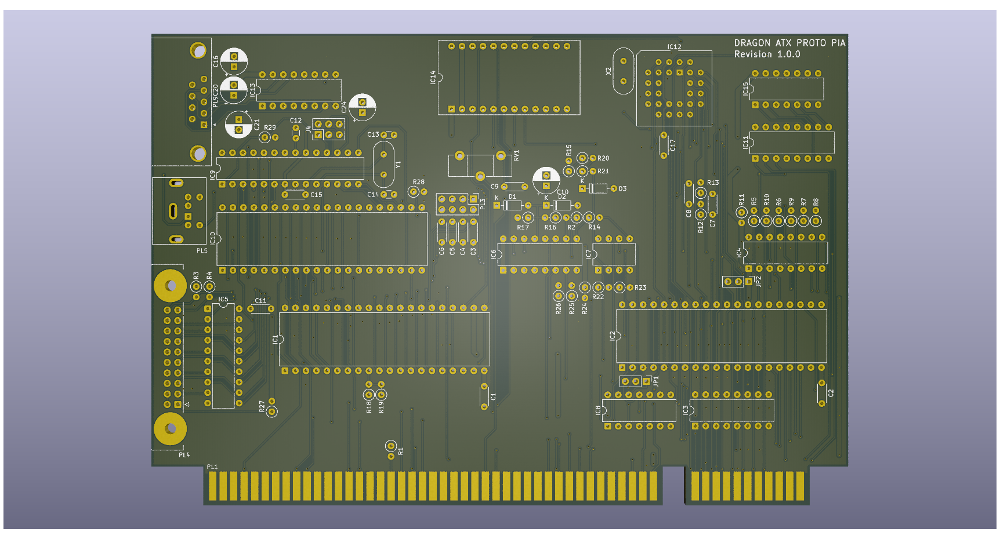

# Dragon 32 ATX Prototype PIA

This repository contains the KiCad project files
to produce the PIA component board for my
ATX Prototype backplane.

This design requires the ATX backplane board in order 
to operate
See https://github.com/jimbro1000/DragonATXProto

## Notes

Revision 1 includes the standard 2 PIAs but also
provides footprints for a dedicated ACIA, as used
on the Dragon 64, and a RTC. Both these extras
utilise the redundant address mappings for PIA 0.

The ACIA and PIA can be omitted without any impact
to the functioning of the computer while in Dragon 32
mode. The ACIA must be present for Dragon 64 mode.

This design has been completed using KiCad 9. Earlier
versions of KiCad are not compatible.
